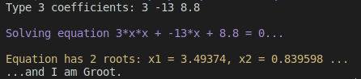
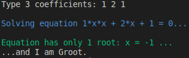
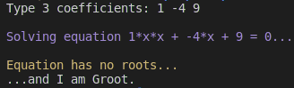

# SquareSolver

 App for solving square equations.

## Build and run

 To compile the project to file run ``make`` in the root directory, it will create ``.\main`` file. Run this file to start app.

## Examples of work

 App works in terminal, so all input and output info is also there. Type coefficients of quadratic equation at first, then type <Enter>, app will solve your task. There are three possible ways:

### Equation has 2 roots:

 

### Equation has 1 root only:

 

### Equation has no roots:

 

## Tests

 Program is tested, but you can test it more in ``./Test`` directory by writing unit tests in ``./Test/TestInfo.txt``.
